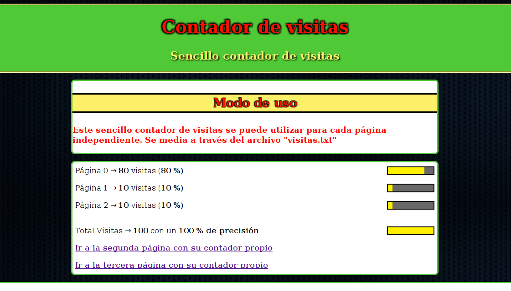

# Aplicación
Llevar un contador de visitas en un archivo

## Objetivos Principales
- Cada página guarda información en un archivo csv de las visitas que ha tenido

## Modo de uso
- Importar el archivo de funciones para los contadores
```php
    include 'funciones.php';
```
- Aumentar Contador de la página actual
```php
    contador($archivos[número_de_pagina]);
```

- Generar estadísticas y mostrarlas en el bloque actual
```php
    visitas();
```

## Previsualización de la aplicación

