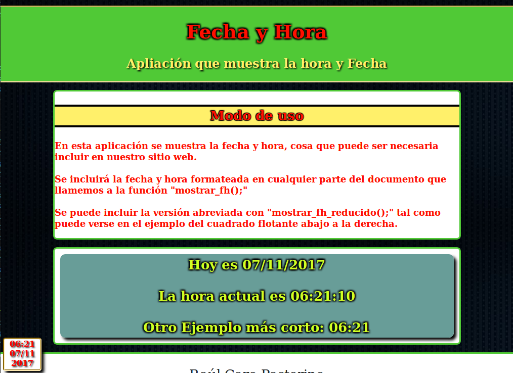

# Aplicación para mostrar la fecha y hora formateada

## El objetivo principal es mostrar la fecha y la hora llamando solo a una función para la versión larga y otra para la versión corta.

## Licencia GPLv3
author Raúl Caro Pastorino
copyright Copyright © 2017 Raúl Caro Pastorino
license https://www.gnu.org/licenses/gpl-3.0-standalone.html

## Previsualización de la aplicación

