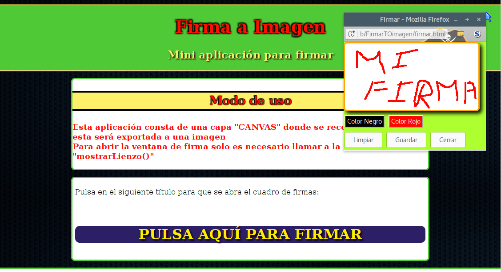

# Capturar Firma

## Captura la firma para dejarla en una imagen

## Licencia GPLv3
author Raúl Caro Pastorino
copyright Copyright © 2017 Raúl Caro Pastorino
license https://www.gnu.org/licenses/gpl-3.0-standalone.html

#A tener en cuenta
- Es necesario tener en cuenta que javascript debe estar habilitado
- Los bloqueadores de anuncios pueden influir en el correcto funcionamiento.
- El servidor debe ser posible que procese php
- El directorio firmas tiene que tener permisos de escritura para que sea posible incluir la imagen de la firma
- Es totalmente factible procesar la imagen a una base de datos en vez del directorio

## Previsualización de la aplicación

