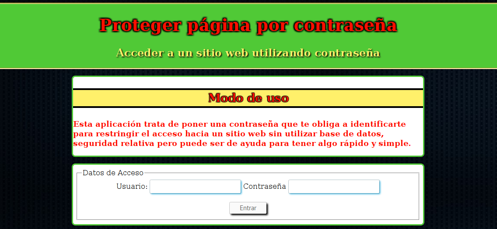

# Proteger sitio web por contraseña

## Objetivos Principales
Esconder el acceso a un sitio web mediante contraseña. Esto no es del todo seguro pero da una capa extra de oscuridad.

Para el correcto funcionamiento se debe tener correctamente establecido permisos en cada archivo y en la página escondida, esta solo será accesible desde un include/requiere al introducir contraseña correctamente.

## Licencia GPLv3
author Raúl Caro Pastorino

copyright Copyright © 2017 Raúl Caro Pastorino

license https://www.gnu.org/licenses/gpl-3.0-standalone.html

## Previsualización de la aplicación

