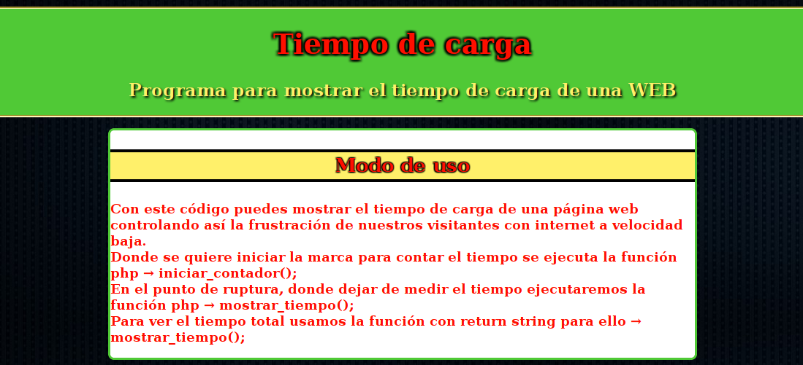

# Mostrar tiempo al cargar una página

## Objetivos Principales
Crear una función que muestre el tiempo que tarda una página en cargarse

## Licencia GPLv3
author Raúl Caro Pastorino

copyright Copyright © 2017 Raúl Caro Pastorino

license https://www.gnu.org/licenses/gpl-3.0-standalone.html

## Previsualización de la aplicación

