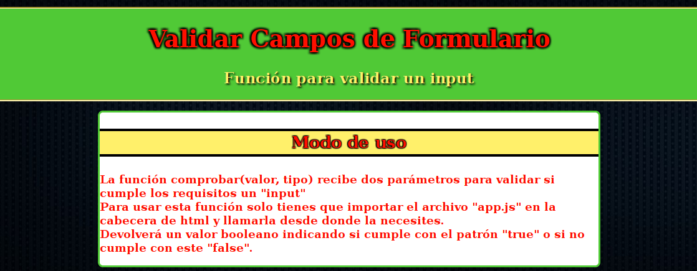
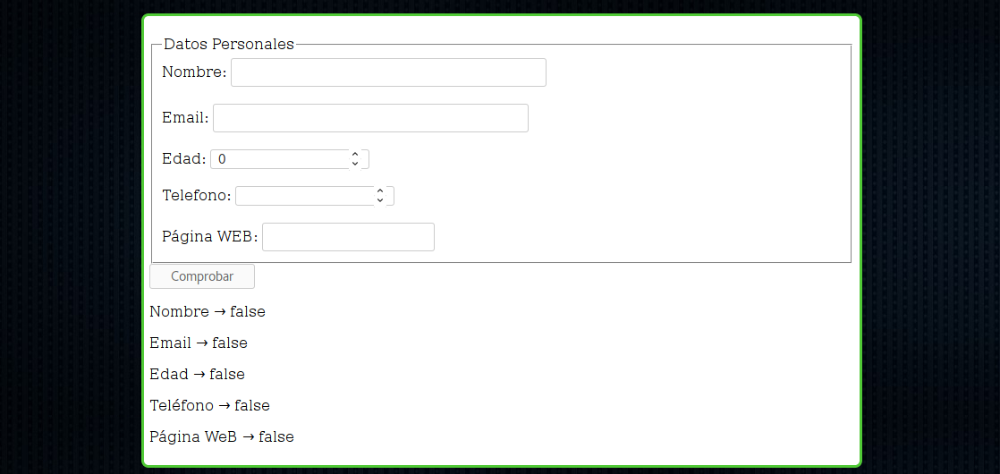

# Validar entrada de formularios

## Objetivos Principales
Una función fácilmente incorporable a cualquier formulario que permita la validación de cualquier tipo de entrada pasándole el valor y el tipo.

Se recibirá un booleano donde "true" significará que es correcto según al patrón que se le ha pasado.

## Licencia GPLv3
authores:
- María Valderrama Rodríguez @mavalroot
- Raúl Caro Pastorino @fryntiz

copyright Copyright © 2017 Raúl Caro Pastorino

license https://www.gnu.org/licenses/gpl-3.0-standalone.html

## Previsualización de la aplicación

